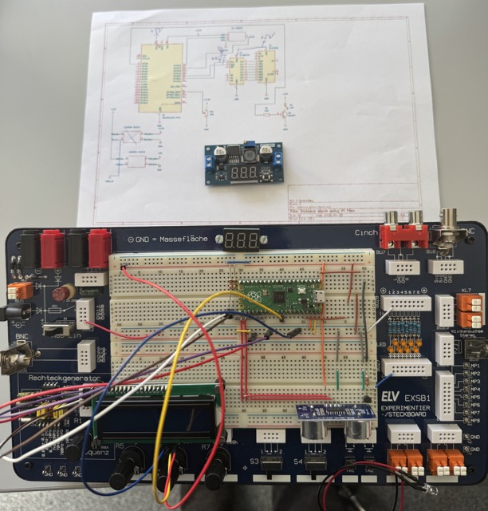

# distance_alarm
Measure distances using raspberry pi pico

This project aims to support you in building a simple measuring application.

You need these components:

* Raspberry pi pico or better
* A power source, eg. 12V battery
* HC-SR04-P sensor
* 12v led or equivalent
* 1 npn transistor
* 1 2k2 resistor
* 2 10k resitors
* step-down regulator to convert to 5V
* 1602 HD44780 display with I2C connector or board
* some soldering equipment
* for the housing a 3D printer

The prototype looks like this:

The schema could be found in the kicad folder.

some stl and other supporting files are located in the freecad folder.

Please use thonny to test the application and your setup.

