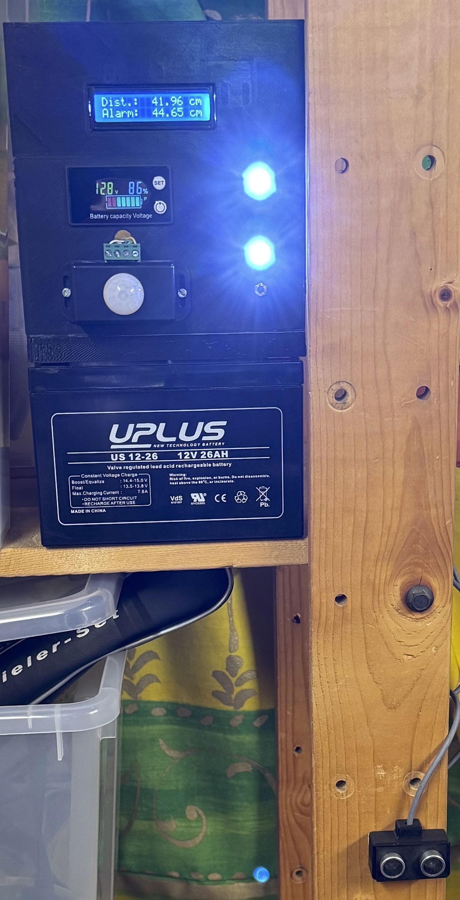
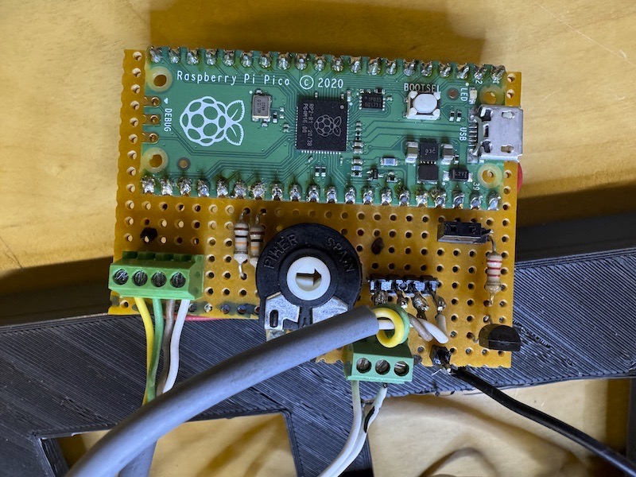
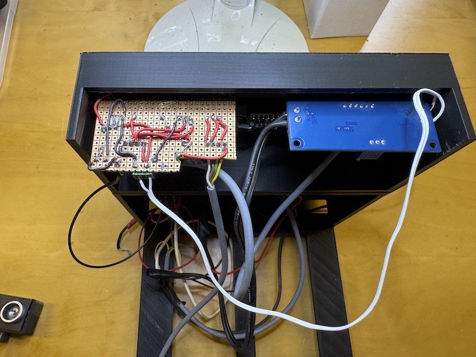
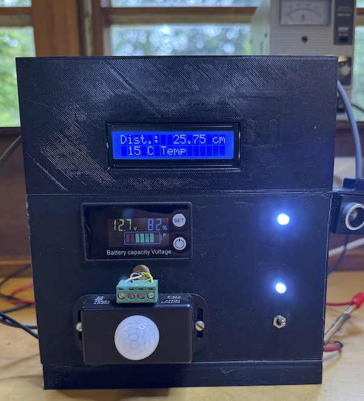
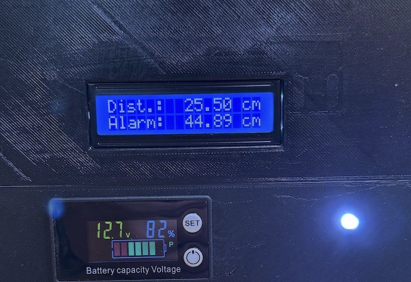
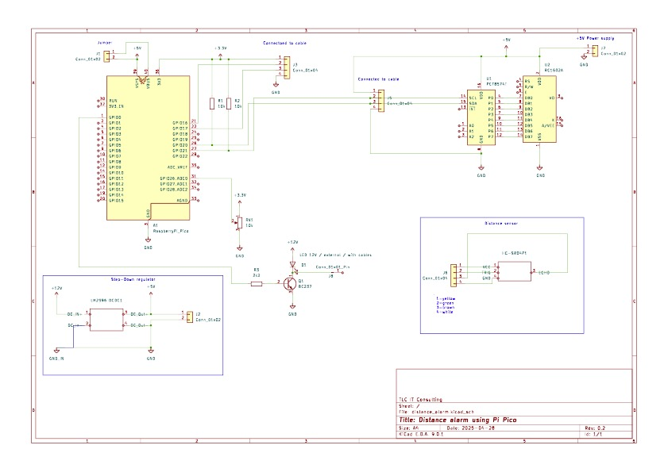

# Distance alarm using pi pico
Measure distances using raspberry pi pico

This project aims to support you in building a simple measuring application.

You need these components:

* Raspberry pi pico or better
* A power source, eg. 12V battery
* HC-SR04-P sensor
* 12v led or equivalent
* 1 npn transistor
* 1 2k2 resistor
* 2 10k resitors
* step-down regulator to convert to 5V
* 1602 HD44780 display with I2C connector or board
* some soldering equipment
* for the housing a 3D printer

The prototype looked like this:

The alarm in operation looks like this:

The top LED fickers when the distance gets greater, the lower LED indicates "in operation". The housings sit on a 12V battery, you could definetly use a one with lower capacity (!). Left to the LEDs you see a motion detector to turn on the power, so not always power is consumed. On top of that a display shows the capacity of the battery.

The distance sensor could be found on the lower end, fixed by tape on the IKEA shelf :) 

This is my layout, using mostly components that I had at hand:

Soldered end:

In my little laboratoy it looked like this showing the two possible information:

The temp is only shown occasionally...

But the setup distance/alarm (use the poti to set this up) shows in most cases:

 

The schema and a pcb layout that may help you solder it (!not perfect, do not print!) could be found in the kicad folder.

The stl and FCStd files are located in the freecad folder besides the box I used for the sensor and the original box for the display.

Please use thonny to test the application and your setup.

## Be careful
If you unsolder the pins from the HC-SR04-P sensor, make sure to solder a connection between the two layers. If you only connect to one layer some signals may get lost...

## About the housing
The housing for the lcd display should be rotated by 180° to show the info in the right direction. As I did not want to print the housing again, I simpoly rotated the whole housing...

The distance for the step-down pcb could be made a little bit wider...

## About the pcb
Th connector to the lcd is somehow wrong connected, not 1:1. Please be careful when you connect the display via I2C and use the right pins.

Do **not** use the pcp to print your board. Do only hard-wiring as I did or enhance the layout!

## About the LED
The 12v led is connected to the NPN Transistor. If you will use different LED-types, the transistor may not be needed.
